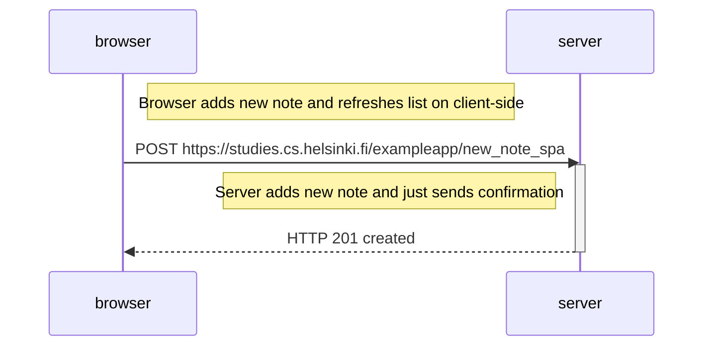

```mermaid
sequenceDiagram
    participant browser
    participant server

    Note right of browser: Browser adds new note and refreshes list on client-side
    browser->>server: POST https://studies.cs.helsinki.fi/exampleapp/new_note_spa
    activate server
    Note left of server: Server adds new note and just sends confirmation
    server-->>browser: HTTP 201 created
    deactivate server
```
